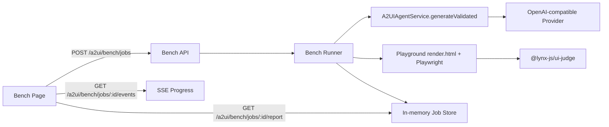

# A2UI Bench Agent Backend Design

## Goal

让 `packages/genui/a2ui-playground` 的 Bench 页面从本地模拟数据升级为真实 bench：

- 用户在 Bench 页面配置实验组、对照组、场景、`OPENAI_API_KEY`、`OPENAI_BASE_URL`、`OPENAI_MODEL` 后，可以触发真实 A2UI agent 生成。
- 每个 group/scenario/repeat 都通过服务端调用真实 agent，产出 A2UI messages、校验结果、attempts、usage、耗时和渲染指标。
- Bench 运行过程可以在前端展示进度，运行完成后产出结构化 report，并支持下载/复制。
- 先复用已有 `packages/genui/server` 的 A2UI agent 能力，再补 bench 专用 job/runner/report API。

本文只描述方案，不做实现。

## Existing Building Blocks

当前仓库已经有几块可以直接复用的能力：

- A2UI agent server: `packages/genui/server`
  - `/a2ui/chat`: 非流式生成，支持 validation/repair。
  - `/a2ui/stream`: SSE 流式生成，支持 protocol parser、validation、repair、payload publishing。
  - `/a2ui/action`、`/a2ui/action/stream`: 处理 A2UI user action 的后续响应。
  - `/a2ui/health`: 暴露 server 端 OpenAI 配置健康状态。
- Agent service: `packages/genui/server/service/a2ui-agent.ts`
  - `generateValidated(...)`: 调用 agent，按 catalog 校验并修复。
  - `streamAsAsyncIterable(...)`: 流式调用并最终 finalize usage/finishReason。
  - cache key 已按 `baseURL/model/apiKey/catalog` 区分 agent。
- Provider: `packages/genui/server/agent/openai-provider.ts`
  - 使用 `@ai-sdk/openai` + Mastra。
  - 支持 `OPENAI_API_KEY`、`OPENAI_BASE_URL`、`OPENAI_MODEL`、`OPENAI_API_STYLE`。
  - 非官方 OpenAI base URL 默认走 chat-compatible 模式。
- Playground render surface: `packages/genui/a2ui-playground/src/render.tsx`
  - `/render.html?...` 承载 `<lynx-view>`，可以用 generated messages 渲染真实 A2UI 结果。
  - 已有 render/performance 相关逻辑，可作为 bench 渲染指标采集入口。
- UI judge: `packages/genui/ui-judge`
  - `judgePage(...)` 可对 Playwright page 打分。
  - 支持 GEQI dimensions。
  - 当前测试已有 playground preview server helper，可复用生成 `/render.html` URL 的思路。

## Non-Goals

- 不在浏览器端直接调用 OpenAI。
- 不把公共线上 server 变成任意 API key/baseURL 的开放代理。
- 不在第一版实现跨机器持久化 job 队列。
- 不在第一版实现 Native/Android bench。先完成 Web render bench，Native 后续扩展。

## High-Level Architecture



第一版推荐把 bench backend 放在 `packages/genui/server`，因为真实 agent、provider、CORS、rate-limit 已经在那里。

前端 `BenchPage` 只需要把当前配置序列化为 `BenchJobRequest`，发给 server 并订阅进度。

## API Design

### POST `/a2ui/bench/jobs`

创建并启动一个 bench job。

Request:

```ts
interface BenchJobRequest {
  provider: {
    apiKey?: string;
    baseURL?: string;
    model?: string;
    api?: 'chat' | 'responses';
  };
  settings: {
    repeats: number;
    parallelism: number;
    maxRepairAttempts: number;
    judgeEnabled: boolean;
    renderMetricsEnabled: boolean;
    timeoutMs?: number;
  };
  groups: BenchGroupRequest[];
  scenarios: BenchScenarioRequest[];
}

interface BenchGroupRequest {
  id: string;
  role: 'control' | 'experiment';
  name: string;
  variable: 'model' | 'prompt' | 'catalog' | 'custom';
  enabled: boolean;
  model?: string;
  catalog?: 'Full Catalog' | 'Core Catalog' | 'Minimal Catalog';
  extraInstruction?: string;
}

interface BenchScenarioRequest {
  id: string;
  name: string;
  prompt: string;
  type: string;
  complexity?: number;
  action?: string;
  judgeTask?: string;
  judgeSteps?: string[];
}
```

Response:

```ts
interface BenchJobCreated {
  ok: true;
  jobId: string;
  statusUrl: string;
  eventsUrl: string;
  reportUrl: string;
}
```

### GET `/a2ui/bench/jobs/:jobId`

返回 job 快照，适合刷新页面后恢复状态。

```ts
interface BenchJobSnapshot {
  ok: true;
  jobId: string;
  status: 'queued' | 'running' | 'complete' | 'failed' | 'cancelled';
  progress: {
    completedRuns: number;
    totalRuns: number;
    current?: {
      groupId: string;
      scenarioId: string;
      repeatIndex: number;
      phase: BenchRunPhase;
    };
  };
  summary?: BenchReportSummary;
  error?: string;
}
```

### GET `/a2ui/bench/jobs/:jobId/events`

SSE 推送进度。

Events:

- `job`: job 状态变化。
- `run-start`: 单个 run 开始。
- `run-phase`: 单个 run 的阶段变化。
- `run-complete`: 单个 run 结果。
- `run-error`: 单个 run 失败。
- `report`: 最终报告。
- `error`: job 级错误。

```ts
type BenchRunPhase =
  | 'queued'
  | 'agent'
  | 'validate'
  | 'render'
  | 'judge'
  | 'complete'
  | 'failed';
```

### DELETE `/a2ui/bench/jobs/:jobId`

取消 job。

第一版可以通过 `AbortController` 取消尚未开始和正在等待的 run；已发出的 LLM 请求如果 provider 不支持中止，则尽力忽略其结果。

### GET `/a2ui/bench/jobs/:jobId/report`

返回完整 report。

## Runner Design

### Run Matrix

Runner 根据 enabled groups、scenarios、repeats 展开 run matrix：

```ts
for group in enabledGroups:
  for scenario in scenarios:
    for repeatIndex in 1..repeats:
      enqueue({ group, scenario, repeatIndex })
```

并发由 `settings.parallelism` 控制，推荐第一版限制为 `1..4`，防止本地开发时打爆模型和 Playwright。

### Per-Run Flow

每个 run 按以下阶段执行：

1. Build prompt
   - 基于 scenario prompt 构造 user message。
   - 将 group 的变量映射到 request：
     - `model`: 覆盖 `provider.model`。
     - `prompt`: 追加 `extraInstruction` 到 system appendix 或 user prompt。
     - `catalog`: 选择 catalog subset。
     - `custom`: 同时允许 model/catalog/extraInstruction 覆盖。
2. Agent generation
   - 调用 `A2UIAgentService.generateValidated(...)`。
   - 记录 `agentStartAt`、`agentEndAt`、`usage`、`finishReason`、`attempts`、validation errors。
3. Render
   - 将生成的 A2UI messages 注入 playground render runtime。
   - 推荐 server 侧用 Playwright 打开 `/render.html`，通过 query 或临时 payload store 传入 messages。
   - 采集 FMP/TTI/render metrics。
4. Judge
   - 若 `judgeEnabled`，调用 `judgePage(...)`。
   - `task` 优先使用 scenario.judgeTask，否则使用 scenario.prompt。
   - `steps` 优先使用 scenario.judgeSteps，否则为空；若 scenario.action 存在，可生成一个轻量步骤，例如 `Click the primary action if it is visible.`
5. Persist result
   - 写入 job store。
   - 推送 `run-complete`。

## Prompt Strategy

推荐把 prompt 构造成稳定模板，避免不同 run 因上下文描述漂移而不可比：

```text
Generate one A2UI v0.9 UI for the following benchmark scenario.

Scenario name: {scenario.name}
Scenario type: {scenario.type}
Required action: {scenario.action}
User request:
{scenario.prompt}

Benchmark constraints:
- Return only valid A2UI protocol messages.
- Use the selected catalog only.
- Do not include benchmark metadata in the UI.

Group instruction:
{group.extraInstruction}
```

为了让 control/experiment 可比，除 group-specific overrides 外，其它系统 prompt、catalog、temperature 等都应固定。

## Catalog Strategy

`BenchPage` 当前有 `Full Catalog`、`Core Catalog`、`Minimal Catalog`。后端需要把它们映射成真实 `A2UICatalog`：

- `Full Catalog`: 当前 `BASIC_CATALOG`。
- `Core Catalog`: Text / Row / Column / Card / Button / Image / List / Divider。
- `Minimal Catalog`: Text / Row / Column / Card / Button。

第一版可以在 server 里新增 `bench-catalog.ts`，从 `BASIC_CATALOG` 按 component name 过滤。

## Render Metrics

建议 report 至少包含：

- `agentMs`: agent 调用耗时。
- `validationMs`: validation + repair 耗时。
- `renderMs`: render.html 从 navigation 到 A2UI stable 的耗时。
- `fmpMs`: first meaningful paint。第一版可用 render runtime 的 ready event 或第一批 A2UI surface committed 时间近似。
- `ttiMs`: 若 scenario.action 存在，等 primary action 可交互；否则等 A2UI stable。
- `tokens`: 从 provider usage 中归一化得到。
- `attempts`: validation repair attempts。
- `judgeScore`: ui-judge 分数。

### Render Harness

推荐新增 server-side helper：

```ts
interface RenderBenchResult {
  url: string;
  fmpMs: number;
  ttiMs: number;
  renderMs: number;
  screenshotPath?: string;
}

async function renderA2UIBenchCase(options: {
  messages: unknown[];
  scenario: BenchScenarioRequest;
  theme: 'light' | 'dark';
  viewport: { width: number; height: number };
  signal: AbortSignal;
}): Promise<RenderBenchResult>;
```

实现方式：

- 本地开发：使用 `http://127.0.0.1:4174/render.html` 或从 env 读取 `A2UI_PLAYGROUND_BASE_URL`。
- CI/服务端：可启动 preview server，也可要求外部提供 `A2UI_PLAYGROUND_BASE_URL`。
- messages 传递：
  - 小 payload：直接用 `src/utils/renderUrl.ts` 当前 base64 query 方案。
  - 大 payload：新增 bench-local payload store，返回 `messagesUrl`，避免 URL 过长。

## ui-judge Integration

`@lynx-js/ui-judge` 依赖 Midscene 环境变量：

- `MIDSCENE_MODEL_BASE_URL`
- `MIDSCENE_MODEL_API_KEY`
- `MIDSCENE_MODEL_NAME`
- `MIDSCENE_MODEL_FAMILY`

Bench backend 的 `OPENAI_*` 用于 A2UI generation；judge 使用 Midscene env。两者不要混用，避免前端配置误以为能控制 judge model。

第一版策略：

- 如果 `judgeEnabled` 但 Midscene env 不完整，返回 `judgeScore: 0` 和 `judge.error`，不要让整个 run 失败。
- 后续可加 judge provider 配置，但不建议在第一版开放到前端。

## Report Schema

```ts
interface BenchReport {
  id: string;
  createdAt: string;
  completedAt?: string;
  status: 'complete' | 'failed' | 'cancelled';
  settings: BenchJobRequest['settings'];
  provider: {
    baseURL: string;
    model: string;
    apiKeyConfigured: boolean;
  };
  groups: BenchGroupRequest[];
  scenarios: BenchScenarioRequest[];
  results: BenchRunResult[];
  summaries: BenchGroupSummary[];
  errors: BenchRunError[];
}

interface BenchRunResult {
  id: string;
  groupId: string;
  scenarioId: string;
  repeatIndex: number;
  status: 'complete' | 'failed';
  messages?: unknown[];
  text?: string;
  usage?: {
    promptTokens?: number;
    completionTokens?: number;
    totalTokens?: number;
  };
  finishReason?: unknown;
  metrics: {
    agentMs: number;
    validationMs?: number;
    renderMs?: number;
    fmpMs?: number;
    ttiMs?: number;
    tokens?: number;
    attempts: number;
    judgeScore?: number;
  };
  judge?: {
    score: number;
    dimension: string;
    error?: string;
  };
  preview?: {
    renderUrl?: string;
    screenshotUrl?: string;
  };
  error?: string;
}
```

前端现有 mock report 可按这个 schema 替换：

- Metrics cards 读 `summaries`。
- Report table 读 `results/summaries`。
- JSON copy 复制完整 `BenchReport`。

## Security Model

### API Key Handling

当前 server 默认只有 `A2UI_ALLOW_CLIENT_OVERRIDE=1` 时才接受 request body 中的 `apiKey/baseURL/model`。Bench 需要真实跑用户填写的 configure，因此有两种模式：

1. Local trusted mode
   - 仅本地开发启用。
   - 要求 `A2UI_ALLOW_CLIENT_OVERRIDE=1`。
   - 前端可以把 `apiKey/baseURL/model` 发给 `http://127.0.0.1:3060`。
2. Public server mode
   - 不允许前端传 `apiKey`。
   - 使用 server env 的 `OPENAI_*`。
   - 如果未来要支持用户 key，必须加 auth/session、endpoint allow-list、加密存储或一次性内存 token。

Bench 页面应沿用 `AIChatPage` 的策略：只有可信本地 endpoint 才转发 api key；非可信 endpoint 自动剥离 api key。

### Endpoint Allow-List

若允许 `baseURL` override：

- 本地模式可以放开。
- 公共模式必须 allow-list host，禁止 SSRF 内网地址。
- 至少拒绝 `localhost`、`127.0.0.1`、RFC1918 内网、link-local、file/data/custom scheme。

### Limits

新增 bench-specific limits：

- `A2UI_BENCH_MAX_GROUPS` 默认 8。
- `A2UI_BENCH_MAX_SCENARIOS` 默认 12。
- `A2UI_BENCH_MAX_REPEATS` 默认 5。
- `A2UI_BENCH_MAX_PARALLELISM` 默认 4。
- `A2UI_BENCH_JOB_TTL_MS` 默认 30 分钟。
- `A2UI_BENCH_MAX_JOBS_PER_IP` 默认 2。

## Job Store

第一版使用进程内 store：

```ts
class BenchJobStore {
  create(request: BenchJobRequest): BenchJob;
  get(id: string): BenchJob | undefined;
  update(id: string, patch: Partial<BenchJob>): void;
  appendResult(id: string, result: BenchRunResult): void;
  subscribe(id: string): AsyncIterable<BenchJobEvent>;
  cancel(id: string): void;
  sweepExpired(): void;
}
```

这符合现有 server 的部署说明：conversation state 由 client 携带，rate limiter 和 agent cache 都是 process-local。Bench job 比 chat 更长，后续如果要线上稳定使用，可以切 Redis/SQLite/Supabase。

## Frontend Integration Plan

`BenchPage.tsx` 改造为真实 backend 后建议拆分：

- `src/bench/types.ts`: request/report/event 类型。
- `src/bench/endpoints.ts`: endpoint resolution，复用 `AIChatPage` trusted endpoint 逻辑。
- `src/bench/useBenchJob.ts`: create/cancel/subscribe/report hook。
- `src/pages/BenchPage.tsx`: 只保留 UI 状态和 report rendering。

UI 行为：

1. 用户点 `Run Bench`。
2. 前端校验 configure：
   - 至少一个 enabled group。
   - 至少一个 scenario。
   - 若 local trusted endpoint 且 api key 空，提示仍可使用 server env。
3. POST `/a2ui/bench/jobs`。
4. 打开 SSE。
5. 根据 events 更新：
   - progress bar。
   - 当前 run 文案。
   - 每个 group/scenario 状态。
   - partial results。
6. `report` event 到达后替换为最终 report。

## Server File Plan

建议新增/修改：

```text
packages/genui/server/app/a2ui/bench/jobs/route.ts
packages/genui/server/app/a2ui/bench/jobs/[jobId]/route.ts
packages/genui/server/app/a2ui/bench/jobs/[jobId]/events/route.ts
packages/genui/server/app/a2ui/bench/jobs/[jobId]/report/route.ts
packages/genui/server/service/a2ui-bench.ts
packages/genui/server/service/bench-job-store.ts
packages/genui/server/service/bench-render.ts
packages/genui/server/service/bench-catalog.ts
packages/genui/server/service/bench-types.ts
```

可选测试：

```text
packages/genui/server/service/a2ui-bench.test.ts
packages/genui/server/service/bench-job-store.test.ts
packages/genui/a2ui-playground/src/bench/useBenchJob.test.ts
```

## Development Workflow

本地真实 bench 需要两个服务：

```bash
# terminal 1: agent server
cd packages/genui/server
export OPENAI_API_KEY=...
export OPENAI_BASE_URL=...
export OPENAI_MODEL=...
export A2UI_ALLOW_CLIENT_OVERRIDE=1
pnpm dev

# terminal 2: playground
pnpm -C packages/genui/a2ui-playground dev
```

如果要启用 judge：

```bash
export MIDSCENE_MODEL_BASE_URL=...
export MIDSCENE_MODEL_API_KEY=...
export MIDSCENE_MODEL_NAME=...
export MIDSCENE_MODEL_FAMILY=...
```

## Implementation Phases

### Phase 1: Backend runner without render/judge

- 新增 bench API + in-memory job store。
- 跑真实 `A2UIAgentService.generateValidated(...)`。
- 记录 agent/tokens/attempts/validation。
- 前端接 job create/events/report。

价值：最快让 configure 真实影响 bench。

### Phase 2: Render metrics

- 新增 Playwright render harness。
- 注入 generated messages 到 `/render.html`。
- 采集 `renderMs/fmpMs/ttiMs`。
- report 增加 preview URL/screenshot。

价值：从“模型输出 bench”升级为“生成结果可渲染 bench”。

### Phase 3: ui-judge

- 对每个 rendered page 调 `judgePage(...)`。
- 支持 dimension 配置或固定 `visual-correctness`。
- report 增加 judge details。

价值：形成质量维度。

### Phase 4: Robustness

- job cancel、TTL sweep、错误重试。
- endpoint allow-list。
- Redis/Supabase persistence。
- report artifact export。

## Open Questions

- Bench 是否只跑 Web render，还是未来必须覆盖 Native Lynx？
- `Core Catalog` / `Minimal Catalog` 的组件集合是否以上述建议为准？
- Judge 是否需要和 A2UI generation 共用同一模型配置，还是保持 Midscene 独立配置？
- Report 是否需要上传 artifact，还是先只保存在内存并由前端下载？
- 公共线上 server 是否允许用户输入自己的 `OPENAI_API_KEY`？如果允许，需要 auth 和更严格的安全策略。

## Recommended First Cut

优先做 Phase 1 + 前端接入：

1. 新增 `/a2ui/bench/jobs`、`/events`、`/report`。
2. 复用 `A2UIAgentService.generateValidated(...)`。
3. 支持 group model/catalog/prompt overrides。
4. 生成真实 tokens/attempts/agentMs，render/judge 暂时标记为 unavailable。
5. 前端 BenchPage 把现有 mock `buildReport(...)` 替换为 backend report。

这样可以最小风险验证“不同 configure 真实影响 bench 结果”，后面再逐步引入 Playwright render 和 ui-judge。
